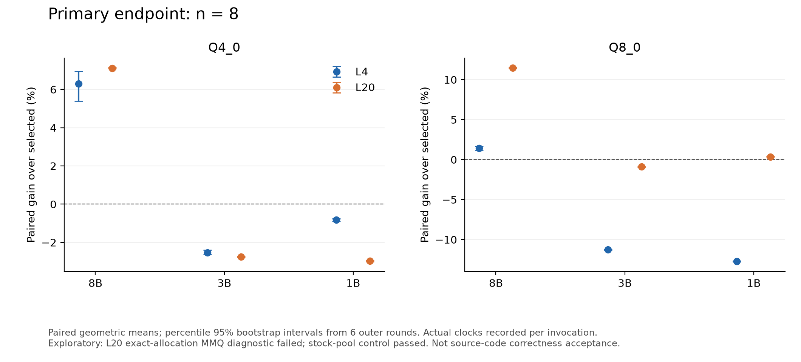
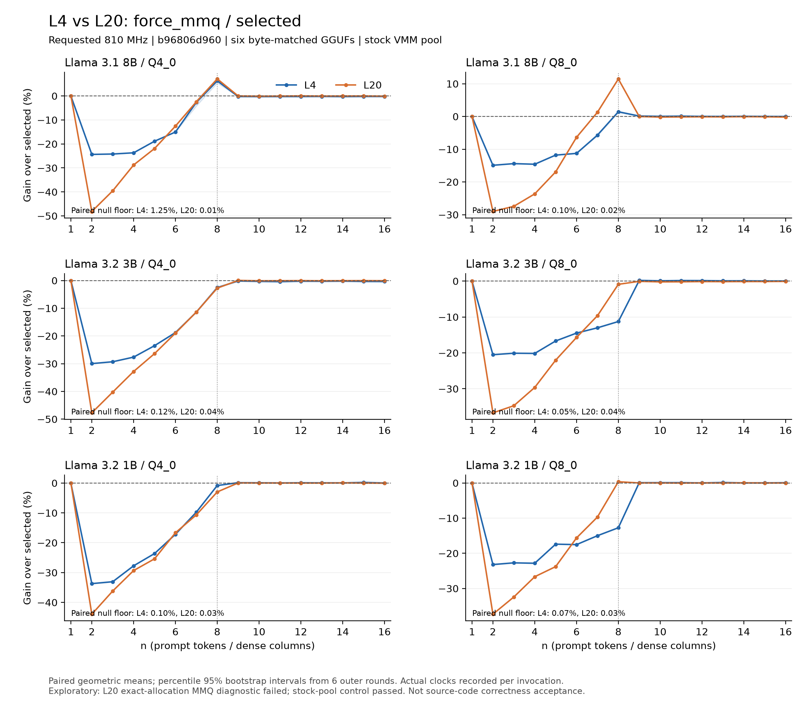

# L20 at 810 MHz: full four-world sweep and paired L4 comparison

This is the L20 experiment requested in [llama.cpp #28090](https://github.com/ggml-org/llama.cpp/issues/28090#issuecomment-6037817653).
Collected by zhihz on 7 October 2026. The complete sweep finished: 144 invocations, 2,304 unique rows, six outer rounds, 30 inner repeats per row.

**Status: exploratory stock-pool performance data. The exact-allocation MMQ diagnostic failed. These measurements are not source-code correctness acceptance.**

## Conditions and input alignment

- NVIDIA L20, Ada `sm_89`, 92 SMs, 48 GB nominal VRAM; driver 580.126.09, nvcc 13.0.88.
- llama.cpp `b96806d96061049a5b574269b049bf6241d63d46`.
- Llama-3.1-8B and Llama-3.2-3B/1B, pure Q4_0 and Q8_0. All six quantized file sizes and SHA-256 hashes match the existing October L4 manifest.
- Four stock-pool timing builds: `selected`, `force_mmq`, `cutoff7`, `null_rebuild`. The force/cutoff patches are restricted to Ada dense Q4_0/Q8_0; they match the collaborator's selector for this experimental domain, but their source hashes differ. No claim of byte-identical selectors or binaries across GPUs is made.
- `nvidia-smi -lgc 810,810`. All invocation-wide busy telemetry samples (`utilization.gpu > 0`) in the L20 summary were at 810 MHz; memory clock was 9,001 MHz and maximum busy-sample temperature was 46 C. Samples do not isolate individual n=8 slices.
- `llama-bench -ngl 999 -fa 1 -n 0 -embd 1 -t 4 -b 2048 -ub 512 -p 1,2,...,16 -r 30 -o json`.
- Binary order rotates in each outer round. Six rounds are not a balanced four-world Latin square. Clock lock was reset after collection.

The L4 comparison uses the raw file already in this repository, `../l4-2026-10-07-pinned-810MHz/raw/bench.jsonl`, originally audited at upstream snapshot `c2ff5407413093b2221d0f51ae5329416eda7893`. The exact input hashes are recorded in `out/comparison.json`.

## Primary endpoint: n = 8

Ratios are paired geometric means of throughput ratios over six outer rounds. Values above 1 favor MMQ. Both GPUs are recomputed with the same reducer; 95% percentile bootstrap intervals use 10,000 resamples of outer rounds, seed 0, and are descriptive rather than simultaneous intervals.

| model | quant | L4 force/selected | L20 force/selected [95% CI] | L20 cutoff7/selected | L20 wins |
|---|---|---:|---:|---:|---:|
| 8B | Q4_0 | 1.06300 | 1.07116 [1.07087, 1.07140] | 1.07063 | 6/6 |
| 8B | Q8_0 | 1.01437 | 1.11463 [1.11432, 1.11505] | 1.11391 | 6/6 |
| 3B | Q4_0 | 0.97471 | 0.97253 [0.97236, 0.97269] | 0.97120 | 0/6 |
| 3B | Q8_0 | 0.88736 | 0.99106 [0.99079, 0.99132] | 0.98966 | 0/6 |
| 1B | Q4_0 | 0.99173 | 0.97028 [0.96987, 0.97072] | 0.96796 | 0/6 |
| 1B | Q8_0 | 0.87269 | 1.00360 [1.00330, 1.00386] | 1.00221 | 6/6 |



L20 8B improves by 7.12% (Q4_0) and 11.46% (Q8_0), six rounds out of six. The 3B cases and 1B Q4_0 regress. L20 1B Q8_0 has a small positive measured difference of about 0.36%; that is not a general small-model benefit.

The L20 unchanged-route controls (n=1 and n=9..16, all intervention worlds) range from 0.99783 to 1.00104. Per-round null results and all n values remain in the CSV and raw files.

## Full curves and statistical boundary



The paired null floor is `max(abs(paired_gm(null_rebuild / selected) - 1))` over n=2..8, separately for each GPU/model/type. For the pinned L4 8B Q4_0 raw data, this definition gives 1.25275%, rather than the 0.63% quoted in its original summary. The n8 win direction is unchanged; the existing L4 summary is preserved and this comparison reports a consistently recomputed statistic.

Matching the requested clock reduces a major confounder but does not isolate SM count. The existing L4 telemetry shows that its selected build did not always hold 810 MHz (8B means about 806.7 MHz for Q4_0 and 796.1 MHz for Q8_0), while the L20 busy-sample summaries are at the pin. Memory bandwidth, L2, driver, power limits and other device differences remain. This experiment does not establish a universal `nsm` cutoff. The newer L20 result also differs from the older CUDA 12.8, unpinned, differently hashed-model experiment; those datasets must not be pooled.

## Correctness and allocation diagnostic

- `selected`, `force_mmq`, and `cutoff7`: each passed 168/168 dense numerical cases for Q4_0/Q8_0, n=2..8, 12 attention/FFN geometries. This excludes the output head and full-model correctness.
- `force_mmq` with a separate exact-allocation diagnostic pool and CUDA Graphs disabled: compute-sanitizer reported **385 errors**. Preserve `gate/force_mmq_exact_pool.log` and `gate/gate.json` as failure evidence.
- Control: selected with the exact pool passed 168 cases, zero memcheck errors.
- Control: force_mmq with the stock pool passed 168 cases, zero memcheck errors.
- Timing binaries retain the original stock pool and source; no padding repair was applied to only the L20 measurements. The stock pool can mask accesses beyond a logical buffer, so its passing diagnostic does not override the failed exact-pool check.

Lowering a routing cutoff into n=2..7 needs a jointly agreed safe-source follow-up. The exact-pool failure alone does not establish that the n8-only cutoff7 intervention is unsafe, nor does this limited numerical gate constitute its complete correctness acceptance.

## Files and provenance

| path | contents |
|---|---|
| `raw/` | original JSON per invocation, combined JSONL, stderr, invocation windows and timestamped telemetry |
| `build/`, `host-metadata/` | compiler/runtime records, CMake caches, measured source files and binary hashes |
| `models.lock.json`, `models.verified.json` | pinned source provenance and exact six-model verification; no weights included |
| `gate/`, `allocator-controls/` | failed exact-allocation diagnostic and successful control logs |
| `execution.json`, `protocol.json`, `exploratory-admission.json` | original collector state, preparation protocol and explicit exploratory admission |
| `analysis.json`, `summary.csv`, `clocks.json` | original collected reductions |
| `SHA256SUMS.json` | original 515-file manifest, all matching after transfer; covers collected files only |
| `out/` | both-GPU paired tables, input provenance, clock review and PNG/SVG/PDF figures |
| `code/`, `patches/` | standalone analysis and plotting, recorded collection/build harness and experimental patches |
| `SHARE_SHA256SUMS` | checksums of every file in this run directory except this manifest itself |

Original collected files are preserved byte-for-byte. Preparation-era `protocol.json` still lists pending gates and `analysis.json` requests clock review; these frozen fields describe their creation stage. Use this README, `execution.json`, the gate/control evidence and `out/clock-review.json` for the reviewed outcome. `code/collector.py` is the recorded collector source for provenance; the included harness is not a turnkey GPU deployment bundle or a claim of another GPU rerun.

## Recompute without a GPU

From the repository root:

```sh
python3 runs/l20-2026-10-07-pinned-810MHz/code/reduce_l4_l20.py --out /tmp/l20-paired-check
diff runs/l20-2026-10-07-pinned-810MHz/out/paired-n8.csv /tmp/l20-paired-check/paired-n8.csv
diff runs/l20-2026-10-07-pinned-810MHz/out/paired-curves.csv /tmp/l20-paired-check/paired-curves.csv
```

The reducer uses only Python's standard library. It verifies the original artifact manifest, raw input hashes, six-model identity and complete paired coverage, and recomputes the clock summary from raw telemetry. Bootstrap resampling follows the recorded collector's implementation.

For figures, install matplotlib separately (the original analysis environment is recorded in `code/analysis-python.lock.txt`), then:

```sh
python3 runs/l20-2026-10-07-pinned-810MHz/code/plot_comparison.py /tmp/l20-paired-check/comparison.json --out /tmp/l20-paired-check/figures
```

Data, tables and documentation follow this repository's CC BY 4.0 terms. The new reduction/plotting scripts use MIT. The included llama.cpp-derived source excerpts retain their original upstream licensing.
